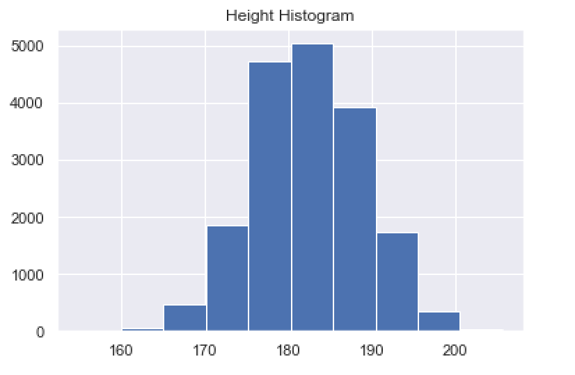
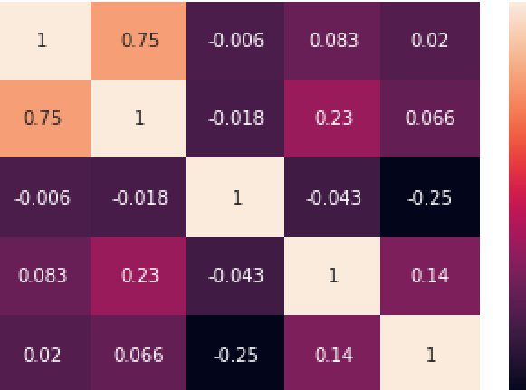

# FIFA Player Analysis Report

## Overview

The FIFA Player Analysis project utilizes exploratory data analysis (EDA) techniques to gain insights into the characteristics of FIFA players. EDA is an approach to analyzing data to summarize their main characteristics, often using statistical graphics and data visualization methods. In this analysis, we have conducted a detailed exploration of the dataset provided in the link.

## Data Processing

The dataset was processed using Python programming language, leveraging libraries such as Pandas, NumPy, Seaborn, and Matplotlib for data manipulation and visualization. The following steps were followed in the coding part:

1. **Reading the Data**: The CSV file containing player data was read into a Pandas DataFrame for further analysis.

2. **Height Statistics**: Statistics were generated on the height column. Since the values were given as strings, they were converted to numerical values for calculations.

3. **Histogram Generation**: A histogram was generated to visualize the distribution of player heights.

4. **Position Mapping**: Data values were matched to their respective positions to analyze the distribution of players across different positions.

## Sample Visualizations

### Sample Bar Chart

The bar chart provides insights into the distribution of players across different positions.

### Sample Heatmap

The heatmap visualizes correlations between different player attributes, providing valuable insights into player characteristics.